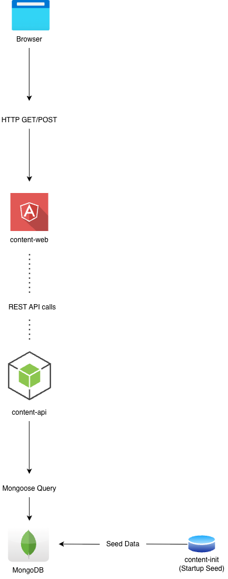

# Welcome to Fabrikam Medical 🩸🏥

Fabrikam Medical Conferences provides conference web site services tailored to the medical community. They started out 10 years ago building a few conference sites for a small conference organizer. Since then, word of mouth has spread, and Fabrikam Medical Conferences now a well-known industry brand. They currently handle over 100 conferences per year and growing.

## Application Overview

## Content Platform – Containerized Setup

This project runs a containerized application composed of four services:

* **content-web** – Frontend web server serving the Angular application and acting as a proxy to the API
* **content-api** – Backend Node.js API that exposes endpoints for sessions, speakers, and statistics
* **content-init** – Initialization service that seeds MongoDB with session and speaker data
* **mongodb** – Database storing application data

All services are orchestrated using Docker Compose.

## Architecture

Browser
↓
content-web (port 3000)
↓
content-api (port 3001)
↓
MongoDB (port 27017)

The `content-init` container runs once during startup to seed the MongoDB database.

### Prerequisites

Ensure the following are installed:

* Docker
* Docker Compose

Verify installation:

docker --version
docker compose version

### Project Structure

~~~
project-root/

content-api/
Dockerfile

content-web/
Dockerfile

content-init/
Dockerfile

docker-compose.yml
~~~

### Build and Run the Application

From the project root directory:

docker compose up --build

This will:

1. Build the images for content-web, content-api, and content-init
2. Pull the MongoDB image
3. Start all containers
4. Run the database initialization job

### Access the Application

Web UI
http://localhost:3000

API Endpoints

Sessions
http://localhost:3001/sessions

Speakers
http://localhost:3001/speakers

Stats
http://localhost:3001/stats

### Verifying Database Data

~~~
Enter the MongoDB container:

docker exec -it mongodb mongosh

Select the database:

use contentdb

Check collections:

show collections

View sessions:

db.sessions.find()

View speakers:

db.speakers.find()
~~~

# Stopping the Application

docker compose down

# Rebuilding Containers

If code changes are made:

docker compose down
docker compose up --build

# Service Communication

Containers communicate using Docker Compose service names:

mongodb → mongodb:27017
content-api → content-api:3001

Example MongoDB connection string:

mongodb://mongodb:27017/contentdb

# Environment Variables

content-web

CONTENT_API_URL=http://content-api:3001

content-api

MONGO_URL=mongodb://mongodb:27017/contentdb

# Logs

View logs for a specific service:

docker logs content-api
docker logs content-web
docker logs mongodb

# Clean Up

Remove containers, networks, and volumes:

docker compose down -v

